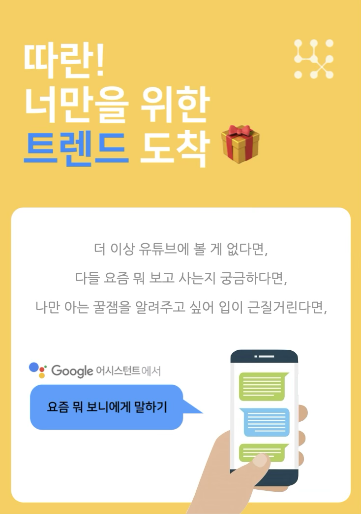

# Lab pj: Trend Bot

Tags: Conversational AI
Role: Developer, Researcher
Date: July 1, 2021 → August 31, 2021

### Summary

---

**트렌드 추천 챗봇 — 참여 기간: 2개월(2021년 7월 ~ 2021년 8월)**

서비스 **이름*: “*요즘 **뭐 **보니*”*

서비스 **목적*:* 각각의 **사용자가 **새롭게 **느낄 **만한 **트렌드를 **주고받을 **수 **있게 **함

서비스 **기능*: 
1)* 유저 **프로파일링 *-* 알고 **있는 **콘텐츠 **범위*,* 개인의 **콘텐츠 **취향
*2)* 대화형으로 **신박한 **키워드를 **추천받음
*3)* 대화형으로 **사람들에게 **공유하고 **싶은 **키워드를 **입력함

서비스 **성과*:*

- 구글 어시스턴트에 성공적으로 배포 승인을 받았으나, 현재는 구글 어시스턴트 커스텀 서비스 운영 종료로 인해 더 이상 이용이 불가능 (소개 문서 링크: [https://www.notion.so/6fbb37714a92463d814c25d967336ac4](https://www.notion.so/6fbb37714a92463d814c25d967336ac4?pvs=21))
- 국내 컨퍼런스 발표 :: 한국HCI학회 2022 튜토리얼 [사용할수록 지식베이스가 성장하는 대화형 서비스 만들기]

### Contributions

---

- 프로젝트는 유즈케이스 탐색 → 대화 설계 → 개발 → 유저 인터뷰 로 진행
- **연구원으로서 프로젝트 전 과정에 참여, 개발 단계에 있어서 리드**

### Background

---

- 배경:
    - 단순한 챗봇은 아무리 잘 만들어도 고정된 답변만을 제공한다는 한계가 있음
    - 사용자의 데이터를 시스템에 반영하여 사용할수록 지식베이스가 성장하는 챗봇이 필요함
- 문제:
    - 어떤 유즈케이스로 성장형 지식베이스를 구현할 수 있는가?
    - 지식베이스 구성과 대화 설계를 어떻게 할 것인가?

### Solutions

---

- 유즈케이스 탐색
    - 지식베이스 구축을 위해서는 사용자가 데이터를 쉽게 제공할 수 있는 도메인이 필요함
    - 사용자는 일상적으로 접하거나 자주 업데이트되는 정보를 더 쉽게 공유함
    - 따라서 짧은 주기로 매일 생성되는 트렌드 도메인을 선정
- 데이터베이스 구조 및 대화 설계
    - 트렌드 키워드를 수집하고 추천
    - 사용자별로 트렌드 키워드의 '새로움'과 '개인 취향(재미)' 피드백을 수집
    - 새로움 지수는 거리가 먼 사용자들의 키워드를 계산하고, 재미 지수는 유사한 사용자 기반 예상 평점을 계산
    - 사용자 응답에 따라 키워드 추천, 평가 요청, 키워드 제안을 유도하는 구조로 설계
- 개발
    - Google Dialogflow를 활용하여 대화 플로우 설계
    - JavaScript로 데이터베이스 연동 및 추천 시스템 구현
    - Firebase Realtime Database로 데이터베이스 구축

### Insights

---

- 3일간 12명의 유저 리서치 진행
- 데이터 분석
    - 트렌드 키워드 수는 기존 113개에서 사용자가 공유한 41개가 더해져 36.3% 증가
    - 평균 ‘새로움’ 지수는 54%, 평균 ‘재미’ 지수는 3.0
- **인사이트**
    - 위키형 데이터베이스가 챗봇에 탑재되어 작동함을 확인
    - 서비스의 첫인상이 지속적인 참여를 결정하므로, 콜드스타트 상황에서는 '신박함'과 ‘재미'가 절대적으로 높은 클러스터에서의 추천 필수